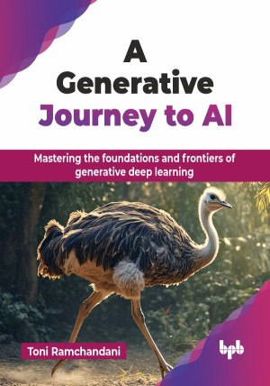

# A Generative Journey to AI

Mastering the foundations and frontiers of generative deep learning.

This is the repository for [A Generative Journey to AI
](https://bpbonline.com/products/a-generative-journey-to-ai?variant=44282877477064),published by BPB Publications.

## About the Book
Explore the world of generative AI, a technology capable of creating new data that closely resembles reality. This book covers the fundamentals and advances through cutting-edge techniques. It also clarifies complex concepts, guiding you through the essentials of deep learning, neural networks, and the exciting world of generative models, like GANs, VAEs, Transformers, etc.

This book introduces deep learning, machine learning, and neural networks as the foundation of generative models, covering types like GANs and VAEs, diffusion models, and other advanced architectures. It explains their structure, training methods, and applications across various fields. It discusses ethical considerations, responsible development, and future trends in generative AI. It concludes by highlighting how generative AI can be used creatively, transforming fields like art and pushing the boundaries of human creativity, while also addressing the challenges of using these technologies responsibly.

This book provides the tools and knowledge needed to leverage generative AI in real-world applications. By the time you complete it, you will have a solid foundation and the confidence to explore the frontiers of AI.

## What You Will Learn
• Understand the fundamentals of deep learning and neural networks.

• Master generative models like GANs, VAEs, and Transformers.

• Implement AI techniques for text, audio, and video creation.

• Apply generative AI in real-world scenarios and applications.

• Navigate ethical challenges and explore the future of AI.
